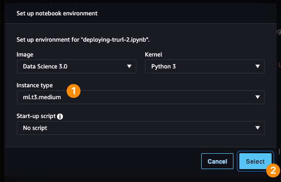

## Deploying *TRURL 2* on *Amazon SageMaker*

This is a repository that contains a demo for deploying [TRURL 2](https://huggingface.co/Voicelab/trurl-2-7b) on [Amazon SageMaker](https://aws.amazon.com/sagemaker), used as a supporting resource [for the article published](https://community.aws/posts/deploying-trurl-2-on-amazon-sagemaker) on the [community.aws](https://community.aws) website.

**TRURL 2** is a family of *Large Language Models (LLMs)*, which are a fine-tuned version of [LLaMA 2](https://ai.meta.com/llama/) with support for *Polish* :poland: language. It was created by [VoiceLab](https://voicelab.ai) and published on [Hugging Face](https://huggingface.co/Voicelab) portal.

### What is *TRURL 2*?

For most people, *TRURL 2* is the least familiar term in the title above - so allow me to start here. As stated above, [TRURL 2](https://huggingface.co/Voicelab#models) is a fine-tuned version of [LLaMA 2](https://ai.meta.com/llama/#inside-the-model). According to the authors, it is trained on over 1.7B tokens (970k conversational Polish and English samples) with a large context of 4096 tokens. To be precise, *TRURL 2* is not a single model but a collection of fine-tuned generative text models with 7 billion and 13 billion parameters, optimized for dialogue use cases. You can read more about it on their official [blog post](https://voicelab.ai/trurl-is-here) after the model's release.

#### Who created *TRURL* family of models?

It was created by a Polish :poland: a company called [Voicelab.AI](https://voicelab.ai). They are based in [Gdańsk](https://en.wikipedia.org/wiki/Gda%C5%84sk) and specialise in developing solutions related to *[Conversational Intelligence](https://voicelab.ai/conversational-intelligence)* and *[Cognitive Automation](https://voicelab.ai/cognitive-automation)*.

#### What does this word mean? Who is *Trurl*? :robot:

Even though *Trurl* as a word may look like a set of arbitrary letters put together, it makes sense. *Trurl* is one of the characters known from [Stanislaw Lem’s](https://en.wikipedia.org/wiki/Stanis%C5%82aw_Lem) science-fiction novel, ["The Cyberiad"](https://en.wikipedia.org/wiki/The_Cyberiad). According to the book's author, *Trurl* is a robotic engineer :robot:, *a constructor*, with almost godlike abilities. In one of the stories, he creates a machine called "*Elektrybałt*", which by description, resembles today’s [GPT](https://en.wikipedia.org/wiki/Generative_pre-trained_transformer) solutions. You can see that this particular name is not a coincidence.

#### What is *LLaMA 2*? :llama:

[LLaMA 2](https://ai.meta.com/resources/models-and-libraries/llama/) is a family of *Large Language Models (LLMs)* developed by [Meta](https://ai.meta.com). This collection of pre-trained and fine-tuned models ranges from 7 billion to 70 billion parameters. As the name suggests, it is a 2nd iteration, and those models are trained on 2 trillion tokens and have double the context length of [LLaMA 1](https://ai.meta.com/blog/large-language-model-llama-meta-ai).

## Prerequisites and Setup

To successfully execute all steps in the given repository, you need to have the following prerequisites:

- Pre-installed tools:
  - Most recent *AWS CLI*.
  - *AWS CDK* in version 2.104.0 or higher.
  - Python 3.10 or higher.
  - Node.js v21.x or higher.
- Configured profile in the installed *AWS CLI* with credentials for your *AWS IAM* User account.

### How to use that repository?

First, we need to configure the local environment - and here are the steps:

```shell
# Do those in the repository root after checking out.
# Ideally, you should do them in a single terminal session.

# Node.js v21 is not yet supported inside JSII, but it works for that example - so "shush", please.
$ export JSII_SILENCE_WARNING_UNTESTED_NODE_VERSION=true

$ make
$ source ./.env/bin/activate

$ cd ./infrastructure
$ npm install

# Or `export AWS_PROFILE=<YOUR_PROFILE_FROM_AWS_CLI>`
$ export AWS_DEFAULT_PROFILE=<YOUR_PROFILE_FROM_AWS_CLI>
$ export AWS_USERNAME=<YOUR_IAM_USERNAME>

$ cdk bootstrap
$ npm run package
$ npm run deploy-shared-infrastructure

# Answer a few AWS CDK CLI wizard questions and wait for completion.

# Now, you can push code from this repository to the created AWS CodeCommit git repository remote.
#
# Here you can find an official guide on how to configure your local `git` for AWS CodeCommit:
#   https://docs.aws.amazon.com/codecommit/latest/userguide/setting-up.html

$ git remote add aws <HTTPS_REPOSITORY_URL_PRESENT_IN_THE_CDK_OUTPUTS_FROM_PREVIOUS_COMMAND>
$ git push aws main

$ npm run deploy

# Again, answer a few AWS CDK CLI wizard questions and wait for completion.
```

Now, you can go to the newly created *Amazon SageMaker Studio* domain and open studio prepared for the provided username.


After the studio successfully starts, in the next step, you should clone the *AWS CodeCommit* repository via the *user interface* of *SageMaker Studio*.

Then, we need to install all project dependencies, and it would be great to enable the *Amazon CodeWhisperer* extension in your *SageMaker Studio* domain if you would like to do that in the future on your own, [here you can find the exact steps](https://docs.aws.amazon.com/codewhisperer/latest/userguide/sagemaker-setup.html). In our case, steps up to the 4th point are automated by the provided *infrastructure as code* solution. You should open the *Launcher tab* to execute the last two steps.


Then, in the *System terminal* (not the *Image terminal* - see the difference in the image above), run the following scripts:

```shell
# Those steps should be invoked in the *System terminal* inside *Amazon SageMaker Studio*:

$ cd deploying-trurl-2-on-amazon-sagemaker
$ ./install-amazon-code-whisperer-in-sagemaker-studio.sh
$ ./install-project-dependencies-in-sagemaker-studio.sh
```

Force refresh the browser tab with *SageMaker Studio*, and you are ready to proceed. Now it's time to follow the steps inside the notebook available in the `trurl-2` directory and explore the capabilities of the *TRURL 2* model that you will deploy from the *SageMaker Studio* notebook as an *Amazon SageMaker Endpoint*, and *CodeWhisperer* will be our AI-powered coding companion throughout the process.

### Exploration via *Jupyter Lab 3.0* in *Amazon SageMaker Studio*

So now it's time to deploy the model as a *SageMaker Endpoint* and explore the possibilities, but first - you need to locate and open the notebook.


After opening it for the first time, a new dialog window will appear, asking you to configure *kernel* (the environment executing our code inside the notebook). Please configure it according to the screenshot below. If that window did not appear, or you've closed it by accident - you can always find that in the opened tab with a notebook under the 3rd icon on the screenshot above.



Now, you should be able to follow instructions inside the notebook by executing each cell with code one after another (via the toolbar or keyboard shortcut: `CTRL/CMD + ENTER`). Remember that before executing the clean-up section and invoking the cell with `predictor.delete_endpoint()`, you should *stop* :stop:, as we will need the running endpoint for the next section.

### Developing a prototype chatbot application with *Streamlit*

We want to use the deployed *Amazon SageMaker Endpoint* with *the TRURL 2* model to develop a simple *chatbot* application that will play in a game of *20 questions* with us. You can find an example of an application developed using *Streamlit* that can be invoked locally (assuming you have configured *AWS* credentials properly for the account) or inside *Amazon SageMaker Studio*.


To run it locally, you need to invoke the following commands:

```shell
# If you use the previously used terminal session, you can skip this line:
$ source ./.env/bin/activate

$ cd trurl-2
$ streamlit run chatbot-app.st.py
```

If you would like to run that on the *Amazon SageMaker Studio*, you need to open *System terminal* as previously and start it a bit differently:

```shell
$ conda activate studio
$ cd deploying-trurl-2-on-amazon-sagemaker/trurl-2
$ ./run-streamlit-in-sagemaker-studio.sh chatbot-app.st.py
```

Then, open the URL marked with a green color, as in the screenshot below:


Remember that in both cases, to communicate with the chatbot, you must pass the name of *Amazon SageMaker Endpoint* in the text field inside the left-hand sidebar. How can you find that? You can either look it up in the *[Amazon SageMaker Endpoints tab](https://eu-west-1.console.aws.amazon.com/sagemaker/home#/endpoints)* (keep in mind it is neither *URL* nor *ARN* - only the name) or refer to the provided `endpoint_name` value inside *Jupyter* notebook when you invoked `huggingface_model.deploy(...)` operation.

If you are interested in a detailed explanation of how we can run *Streamlit* inside *Amazon SageMaker Studio*, have a look at [this post](https://aws.amazon.com/blogs/machine-learning/build-streamlit-apps-in-amazon-sagemaker-studio) from the official *AWS* blog.

### Clean-up and Costs

This one is pretty easy! Assuming that you have followed all the steps inside the notebook in the *SageMaker Studio*, the only thing you need to do to clean up is delete *AWS CloudFormation* stacks via *AWS CDK* (remember to close all the *applications* and *kernels* inside *Amazon SageMaker Studio* to be on the safe side). However, *Amazon SageMaker Studio* leaves a bit more resources hanging around related to the *Amazon Elastic File Storage (EFS)*, so first, you have to delete the stack with *SageMaker Studio*, invoke the clean-up script, and then delete everything else:

```shell
# Those steps should be invoked locally from the repository root:

$ export STUDIO_STACK_NAME="Environment-SageMakerStudio"
$ export EFS_ID=$(aws cloudformation describe-stacks --stack-name "${STUDIO_STACK_NAME}" --query "Stacks[0].Outputs[?OutputKey=='SharedAmazonSageMakerStudioDomainEFS'].OutputValue" --output text)
$ export DOMAIN_ID=$(aws cloudformation describe-stacks --stack-name "${STUDIO_STACK_NAME}" --query "Stacks[0].Outputs[?OutputKey=='SharedAmazonSageMakerStudioDomainId'].OutputValue" --output text)

$ (cd infrastructure && cdk destroy "${STUDIO_STACK_NAME}")

$ ./clean-up-after-sagemaker-studio.sh "${EFS_ID}" "${DOMAIN_ID}"

$ (cd infrastructure && cdk destroy --all)
```

Last but not least - here is a quick summary in terms of *how much that cost*. The most significant cost factor is the machines we created for and inside *the Jupyter Notebook*. Those are: compute for *Amazon SageMaker Endpoint* (1x `ml.g5.2xlarge`) and compute for *kernel* that was used by *Amazon SageMaker Studio Notebook* (1x `ml.t3.medium`). Assuming that we have set up all infrastructure in `eu-west-1`, the total cost of using 8 hours of cloud resources from this code sample will be lower than $15 ([here you can find a detailed calculation](https://calculator.aws/#/estimate?id=789a6cd85ffac96e8b4321cca2a9a4d53cdb5210)). Everything else you created with the *infrastructure as code* (via *AWS CDK*) has a much lower cost, especially within the discussed time constraints.

## Contact

If you have more questions, feel free to [contact me directly](https://awsmaniac.com/contact).

## Security

See [CONTRIBUTING](CONTRIBUTING.md#security-issue-notifications) for more information.

## License

This library is licensed under the *MIT-0* License. See the [LICENSE](LICENSE) file.
